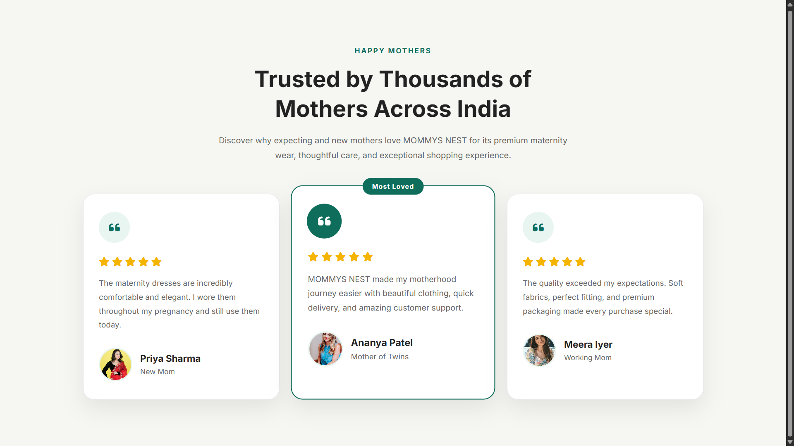

# 💬 Responsive Testimonial Section

A modern and responsive testimonial section built using **HTML5** and **CSS3** for **MOMMYS NEST**, a premium maternity and motherhood brand.

This project showcases customer review cards with profile images, star ratings, hover animations, and a fully responsive layout.

---

## 📸 Preview



---

## ✨ Features

- Responsive Testimonial Cards
- Customer Profile Section
- Five-Star Ratings
- Featured Testimonial Card
- Hover Animations
- Modern Card Design
- Responsive Grid Layout
- Font Awesome Icons
- Google Fonts
- Clean & Minimal UI

---

## 🛠 Technologies Used

- HTML5
- CSS3
- CSS Grid
- Flexbox
- CSS Variables
- Google Fonts (Inter)
- Font Awesome

---

## 📂 Project Structure

```text
responsive-testimonial-section/
│
├── images/
│   ├── customer-1.jpg
│   ├── customer-2.jpg
│   └── customer-3.jpg
│
├── index.html
├── style.css
├── README.md
└── screenshot.png
```

---

## 📚 Day 12 Skills Practiced

- Semantic HTML5
- CSS Variables
- CSS Grid
- Flexbox
- Responsive Design
- Card Components
- Hover Effects
- Image Styling
- Font Awesome Icons
- Google Fonts

---

## 🎯 What I Learned

- Creating responsive testimonial layouts
- Designing reusable card components
- Building profile sections with avatars
- Improving visual hierarchy
- Working with CSS Grid and Flexbox
- Creating subtle hover animations
- Writing clean and organized HTML & CSS

---

## 🚀 Future Improvements

- Testimonial slider using JavaScript
- Auto-play carousel
- Dark Mode
- Filter testimonials by category
- Animated card transitions
- Dynamic reviews from an API

---

## 👨‍💻 Author

**Vignesh**

UI/UX Designer • Front-End Developer

GitHub:
https://github.com/codingwithvignesh

Portfolio:
https://vigneshux.netlify.app

---

⭐ If you like this project, consider giving it a star.
